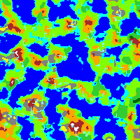
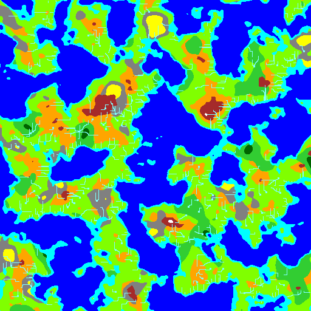
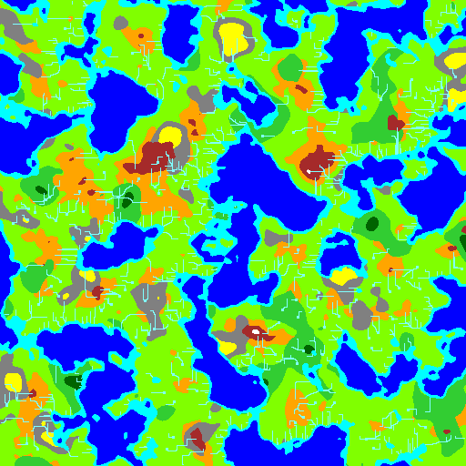

# CreateMap
Simplex Noiseを使用して地形生成するPythonのクラスです。

## 説明
ランダムな地形生成をしてみたくなったので作成しました。
ここ（http://lazylifeeasyexit.blog67.fc2.com/blog-entry-30.html）のフィールドマップ自動生成プログラム（セル・オートマトン、C++）からPythonに移植したが、私の環境で200×200の生成で約15秒かかった。
なので、もっと良い方法を探した結果、Perlin Noiseがあることを知った。
Perlin Noise使用で512×512のオクターブ無しで約5秒になった。
さらに改良版のSimplex Noise（https://github.com/caseman/noise）使用で512×512のオクターブ無しで約0.5秒になった。
かなり速くなったので、このSimplex Noiseを使用して地形生成してみました。

## 必要要件
下記の環境で動かしました。  
- Debian 12 stable
- Python 3.11
- Numpy
- Pillow

## 使用方法
下の方にあるテストコードを見て通りですが簡単に説明。

- コンストラクタ
  - width=地図の大きさ（幅）
  - height=地図の大きさ（高さ）
  - seed=乱数のシード値

- create_map()メソッド
Simplex Noiseをオクターブ合成をしてmap_heightとmap_wetが作成します。
合成回数や周波数（分割数）などのパラメータで複雑さを変更できます。

- create_river()メソッド
map_heightから頂上を見つけて、そこから水を流します。
map_riverを作成します。

- output_pixel()メソッド
map_heightとmap_riverから画像を出力します。
map_riverが無いと河川無しの地形を出力します。
  - pixel_file=保存するファイル名

### デフォルトのまま生成

### 地形の広さとシード値を変更して生成

### 海岸の高さを変更して陸地を多く生成

